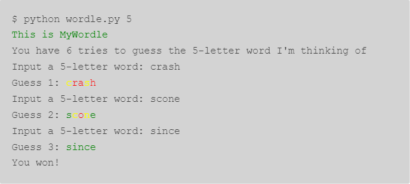
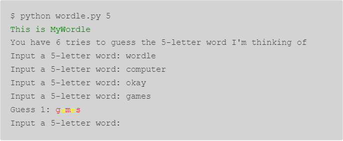
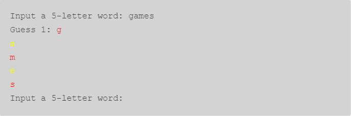

# Wordy

## Table of Contents

- [Part 1: Readability](#part-1-readability)
- [Part 2: Caesar](#part-2-caesar)
- [Part 3: Vigenère](#part-3-vigenère)
- [Part 4: Wordle Clone](#part-4-wordle-clone)

## Overview

This project is a partial port of Harvard University's [CS 50's](https://cs50.harvard.edu/x/2024/) Problem Set 2 to Python. There are four parts. In Part 1, Readability, you will implement a problem that calculates the approximate grade level needed to comprehend some text. In Part 2, Caesar, you will implement a program that encrypts messages using a Caesar cipher. In Part 3, Vigenère, you will implement a program that encrypts message using a Vigenère cipher. In Part 4, Wordle Clone, you will implement a clone similar to the popular [Wordle](https://www.nytimes.com/games/wordle/index.html) daily word game. Each part is worth 25 points, and a rubric is provided below.

*Cite referenced websites and/or collaborators in a file `COLLABORATION.md`. Remember to only discuss problems at a high level with your peers.*

## Policies

### Course Generative AI Policy

No use of ChatGPT, Copilot, or any other automatic code-generation software is allowed in this course for the completion of assignments. The professor may opt to do one or all of the following:

1. Assess and grade the assignment through an oral presentation.
1. Impose a significant penalty for low-energy or unreflective reuse of material generated by AI tools and assign zero points for merely reproducing the output from AI tools.
1. Submit an Academic Integrity Alert after instructors have communicated with the student and determined that AI tools were not used properly.

The course policy supplements, and supersedes, where relevant, the university’s [Generative AI Policy](https://catalog.seu.edu/content.php?catoid=49&navoid=4207#generaitve-assistance-ai-use-policy).

### Collaboration Policy

Students may collaborate on the projects, meaning you're free to seek help from the professor, the internet, or your friends. Any code referenced on internet forums, Stack Overflow, tutorials, or any similar resource that is used to solve a problem should be cited in comments. If two or more students choose to solve a problem together, they are required to write code independently and note all the collaborators. Students cannot use the exact same code (for example, by dictating to each other). As a rule of thumb,  do not look at or copy each other’s code or code structure. Students are not permitted to share/send code to others. The official collaboration policy is that two students may discuss a solution together, but the code must be written separately by each student. No plagiarism or copying of solutions is allowed. **Violations of this policy will result in a zero on the project.**

## Part 1 Readability

According to [Scholastic](https://www.scholastic.com/teachers/teaching-tools/collections/guided-reading-book-lists-for-every-level.html), E.B. White's *Charlotte's Web* is between a second- and fourth-grade reading level, and Lois Lowry's *The Giver* is between an eighth- and twelfth-grade reading level. What does it mean, though, for a book to be at a particular reading level?

Well, in many cases, a human expert might read a book and make a decision on the grade (i.e., year in school) for which they think the book is most appropriate. But an algorithm could likely figure that out too!

So what sorts of traits are characteristic of higher reading levels? Well, longer words probably correlate with higher reading levels. Likewise, longer sentences probably correlate with higher reading levels, too.

A number of "readability tests" have been developed over the years that define formulas for computing the reading level of a text. One such readability test is the Coleman-Liau index. The Coleman-Liau index of a text is designed to output that (U.S.) grade level that is needed to understand some text. The formula is

``` text
index = 0.0588 * L - 0.296 * S - 15.8
```

where `L` is the average number of letters per 100 words in the text, and `S` is the average number of sentences per 100 words in the text.

Let’s write a program called `readability` that takes a text and determines its reading level. For example, if the `readability` function is called with `text` as specified below, the function should behave as follows:

``` python
>>> text = "Congratulations! Today is your day. You're off to Great Places! You're off and away!"
>>> result = readability(text)
>>> result
"Grade 3"
```

The text the user inputted has 65 letters, 4 sentences, and 14 words. 65 letters per 14 words is an average of about 464.29 letters per 100 words (because 65 / 14 * 100 = 464.29). And 4 sentences per 14 words is an average of about 28.57 sentences per 100 words (because 4 / 14 * 100 = 28.57). Plugged into the Coleman-Liau formula, and rounded to the nearest integer, we get an answer of 3 (because 0.0588 * 464.29 - 0.296 * 28.57 - 15.8 = 3): so this passage is at a third-grade reading level.

Let's try another one:

```python
>>> text = " Harry Potter was a highly unusual boy in many ways. For one thing, he hated the summer holidays more than any other time of year. For another, he really wanted to do his homework, but was forced to do it in secret, in the dead of the night. And he also happened to be a wizard."
>>> result = readability(text)
>>> result
"Grade 5"
```

This text has 214 letters, 4 sentences, and 56 words. That comes out to about 382.14 letters per 100 words, and 7.14 sentences per 100 words. Plugged into the Coleman-Liau formula, we get a fifth-grade reading level.

As the average number of letters and words per sentence increases, the Coleman-Liau index gives the text a higher reading level. If you were to take this paragraph, for instance, which has longer words and sentences than either of the prior two examples, the formula would give the text an twelfth-grade reading level.

```python
>>> text = "As the average number of letters and words per sentence increases, the Coleman-Liau index gives the text a higher reading level. If you were to take this paragraph, for instance, which has longer words and sentences than either of the prior two examples, the formula would give the text an twelfth-grade reading level."
>>> result = readability(text)
>>> result
"Grade 12"
```

### Specification

Design and implement a program, `readability`, that computes the Coleman-Liau index of text.

- Implement your program in a file called `readability.py`.
- Your program should count the number of letters, words, and sentences in the text. You may assume that a letter is any lowercase character from `a` to `z` or any uppercase character from `A` to `Z`, any sequence of characters separated by spaces should count as a word, and that any occurrence of a period, exclamation point, or question mark indicates the end of a sentence.
- Your program should print as output `Grade X` where `X` is the grade level computed by the Coleman-Liau formula, rounded to the nearest integer.
- If the resulting index number is 16 or higher (equivalent to or greater than a senior undergraduate reading level), your program should output `Grade 16+` instead of giving the exact index number. If the index number is less than 1, your program should output `Before Grade 1`.

### Walkthrough

The project mirrors the project done in Harvard's CS50 course, but is ported to Python. You might find their walkthrough helpful, although it does reference some ideas specific to the C programming language.

[Link to walkthrough](https://youtu.be/AOVyZEh9zgE)

### How to Test Your Code

Below are ten test cases along with the expected result. Run `pytest tests/readability_test.py` in the terminal to automatically test the program.

- `One fish. Two fish. Red fish. Blue fish.` (Before Grade 1)
- `Would you like them here or there? I would not like them here or there. I would not like them anywhere.` (Grade 2)
- `Congratulations! Today is your day. You're off to Great Places! You're off and away!` (Grade 3)
- `Harry Potter was a highly unusual boy in many ways. For one thing, he hated the summer holidays more than any other time of year. For another, he really wanted to do his homework, but was forced to do it in secret, in the dead of the night. And he also happened to be a wizard.` (Grade 5)
- `In my younger and more vulnerable years my father gave me some advice that I've been turning over in my mind ever since.` (Grade 7)
- `Alice was beginning to get very tired of sitting by her sister on the bank, and of having nothing to do: once or twice she had peeped into the book her sister was reading, but it had no pictures or conversations in it, "and what is the use of a book," thought Alice "without pictures or conversation?"` (Grade 8)
- `When he was nearly thirteen, my brother Jem got his arm badly broken at the elbow. When it healed, and Jem's fears of never being able to play football were assuaged, he was seldom self-conscious about his injury. His left arm was somewhat shorter than his right; when he stood or walked, the back of his hand was at right angles to his body, his thumb parallel to his thigh.` (Grade 8)
- `There are more things in Heaven and Earth, Horatio, than are dreamt of in your philosophy.` (Grade 9)
- `It was a bright cold day in April, and the clocks were striking thirteen. Winston Smith, his chin nuzzled into his breast in an effort to escape the vile wind, slipped quickly through the glass doors of Victory Mansions, though not quickly enough to prevent a swirl of gritty dust from entering along with him.` (Grade 10)
- `A large class of computational problems involve the determination of properties of graphs, digraphs, integers, arrays of integers, finite families of finite sets, boolean formulas and elements of other countable domains.` (Grade 16+)

## Part 2 Caesar

Write a function that encrypts a message using Caesar's cipher.

### Background

Supposedly, Caesar used to "encrypt" (i.e., conceal in a reversible way) confidential messages by shifting each letter therein by some number of places. For instance, he might write A as B, B as C, C as D, …, and, wrapping around alphabetically, Z as A. And so, to say `HELLO` to someone, Caesar might write `IFMMP`. Upon receiving such messages from Caesar, recipients would have to "decrypt" them by shifting letters in the opposite direction by the same number of places.

The secrecy of this "cryptosystem" relied on only Caesar and the recipients knowing a secret, the number of places by which Caesar had shifted his letters (e.g., 1). Not particularly secure by modern standards, but, hey, if you’re perhaps the first in the world to do it, pretty secure!

Unencrypted text is generally called *plaintext*. Encrypted text is generally called *ciphertext*. And the secret used is called a *key*.

| **plaintext**    | H    | E    | L    | L    | O    |
| ---------------- |:----:|:----:|:----:|:----:|:----:|
| **+ key**        | 1    | 1    | 1    | 1    | 1    |
| **= ciphertext** | I    | F    | M    | M    | P    |

More generally, Caesar’s algorithm (i.e., cipher) encrypts messages by "rotating" each letter by *k* positions. More formally, if *p* is some plaintext (i.e., an unencrypted message), *p* is the $i^{th}$  character in *p*, and *k* is a secret key (i.e., a non-negative integer), then each letter, $c_i$ , in the ciphertext, *c*, is computed as

$$
c_i \equiv(p_i+k) \mod 26
$$

wherein $\mod 26$ here means "remainder when dividing by 26." This formula perhaps makes the cipher seem more complicated than it is, but it’s really just a concise way of expressing the algorithm precisely.

### Specifications

Write a function `caesar(text: str, k: int) -> str` that encrypts a message using Caesar's cipher.

- The function should take two parameters, `message` and `k`, where `k` is the rotation.
- The function should return the ciphertext.
- Do not assume that *k* will be between 1 and 26. Your program should work for any integer. But, even if *k* is greater than 26,  alphabetical characters in your program’s input should remain alphabetical characters in your program’s output. For instance, if *k* is 27, `A` should not become `[`even though `[` is 27 positions away from `A` in ASCII; `A` should become `B`, since `B` is 27 positions away from `A`, provided you wrap around from `Z` to `A`.
- Your program must preserve case: capitalized letters, though rotated, must remain capitalized letters; lowercase letters, though rotated, must remain lowercase letters.
- Digits, symbols, and spaces are not encrypted.
- Code is well-documented.

### Examples

```python
>>> caesar("HELLO", 1)
IFMMP
>>> caesar("Hello, World!", 13)
Uryyb, Jbeyq!
>>> caesar("be sure to drink your Ovaltine", 39)
or fher gb qevax lbhe Binygvar
>>> caesar("", 10)	# returns empty string

# Input guards
>>> caesar(12, 1)
Invalid plaintext
>>> caesar("hello", "1")
Invalid key
```

### How to Test Your Code

Run `pytest tests/caesar_test.py` in the terminal to automatically test the program.

## Part 3 Vigenère

Write a function that encrypts a message using Vigenère's cipher.

### Background

Vigenère’s cipher improves upon Caesar’s cipher by encrypting messages using a sequence of keys (or, put another way, a keyword). In other words, if $p$ is some plaintext and $k$ is a keyword (i.e., an alphabetical string, whereby `A` represents `0`, `B` represents `1`, `C` represents `2`, …, and `Z` represents `25`), then each letter, $p_i$, in the ciphertext, $c_i$, is computed as:

$$
c_i \equiv (p_i + k_j) \mod 26
$$

Note this cipher’s use of $k_j$ as opposed to just *k*. And if *k* is shorter than *p*, then the letters in *k* must be reused cyclically as many times as it takes to encrypt *p*.

In other words, if Vigenère himself wanted to say `HELLO` to someone confidentially, using a keyword of, say, `ABC`, he would encrypt the `H` with a key of 0 (i.e., A), the E with a key of 1 (i.e., B), and the first L with a key of 2 (i.e., C), at which point he’d be out of letters in the keyword, and so he’d reuse (part of) it to encrypt the second L with a key of 0 (i.e., A) again, and the O with a key of 1 (i.e., B) again. And so he’d write `HELLO` as `HFNLP`.

| **plaintext**    | H    | E    | L    | L    | O    |
| ---------------- |:----:|:----:|:----:|:----:|:----:|
| **+ key**        | A    | B    | C    | A    | B    |
| **(key as #)**   | 0    | 1    | 2    | 0    | 1    |
| **= ciphertext** | H    | F    | N    | L    | P    |

### Specification

Write a function `vigenere(message: str, key: str) -> str` that encrypts a message using Vigenère's cipher.

- The function should take two parameters, `message` and `key`.
- The `key` can be upper- or lower-case, and it should not change the output.
- The function should return the ciphertext.
- Your program must preserve case: capitalized letters, though rotated, must remain capitalized letters; lowercase letters, though rotated, must remain lowercase letters.
- Digits, symbols, and spaces are not encrypted.
- Code is well-documented.

### Examples

``` python
>>> vigenere("hello", "abc")
hfnlp
>>> vigenere("hello", "AbC")
hfnlp
>>> vigenere("Meet me at the park at 11 am", "bacon")
Negh zf av huf pcfx bt 11 ca
>>> vigenere("", "abc") # returns empty string

# Input guards
>>> vigenere("hello", 1) # The key should be a string
Invalid key
```

### How to Test Your Code

Run `pytest tests/vigenere_test.py` in the terminal to automatically test the program.

## Part 4 My Wordle

For this problem, you’ll implement a program that behaves similarly to the popular Wordle daily word game.



### Background

If you have yet to play Wordle, give it a try! Each day, a new “secret word” is chosen (the same for everyone) and the object is to guess what the secret word is within six tries. Fortunately, given that there are more than six five-letter words in the English language, you may get some clues along the way, and the image above actually shows your friend’s progression through their guesses, using those clues to try to home in on the correct word. Using a scheme similar to the game Mastermind, if after you guess that letter turns green, it means not only is that letter in the secret word that day, but it is also in the correct position. If it turns yellow, it means that the letter guessed appears somewhere in the word, but not in that spot. Letters that turn gray aren’t in the word at all and can be omitted from future guesses.

Let’s finish writing a program called `wordle.py` that enables us to recreate this game and play it in our terminal instead. We’ll make a few slight changes to the game (for example, the way it handles a letter appearing twice in a word isn’t the same as how the real game handles it, but for simplicity’s sake, we’ll err on the side of ease of understanding rather than a perfectly faithful interpretation), and we’ll use red text instead of gray to indicate letters that aren’t in the word at all. At the time the user executes the program, they should decide, by providing a command-line argument, what the length of the word they want to guess is, between 5 and 8 letters.

Here are a few examples of how the program should work. For example, if the user omits a command line argument entirely:

``` text
$ python wordle.py
usage: wordle.py [-h] -s size
wordle.py: error: the following arguments are required: -s/--size
```

If the user instead does provide a command-line argument, but it’s not in the correct range:

``` text
$ python wordle.py -s 4
usage: wordle.py [-h] -s size
wordle.py: error: argument -s/--size: invalid choice: '4' (choose from '5', '6', '7', '8')
```

Here’s how the program might work if the user provides a key of 5:

``` text
$ python wordle.py -s 5
Welcome to MyWordle
You have 6 tries to guess the 5-letter word I'm thinking of
Input a 5-letter word:
```

At which point, the user should type in a 5-letter word. Of course, the user could well be stubborn, and we should make sure they’re following the rules:



*Note: The first line should be `$python wordle.py -s 5`*

Notice that we didn’t even count any of those invalid attempts as guesses. But as soon as they made a legitimate attempt, we counted it as a guess and reported on the status of the word. Looks like the user has a few clues now; they know the word contains an a and an e somewhere, but not in the exact spots they appear in the word games. And they know that g, m, and s don’t appear in the word at all, so future guesses can omit them. Perhaps they might try, say, heart next! ❤️

### Specification

Design and implement a program, `wordle.py`, that completes the implementation of our Wordle clone of the game. You’ll notice that some large pieces of this program have already been written for you–you are not allowed to modify any of those parts of the program. Instead, your work should be constrained to the seven `TODO`s we’ve left behind for you to fill in. Each one of those parts solves a specific problem, and we recommend you tackle them in order. Each numbered `TODO` corresponds to the same item in the below list.

- For `TODO #1`, you will implement argument parsing to accept a word length from the command line. This will involve setting up the argument parser to store the word length in a variable called word_size. Your implementation should ensure that the game accepts a specific command-line argument for the word length, adhering to the requirements detailed in the provided solution structure. Here are the key points to consider while completing this task:

  - The program must require the user to specify the size of the word to guess using a command-line argument (`-s` or `--size`). This argument represents the length of the word and must be one of four specific values: 5, 6, 7, or 8.
  - If the program is run without specifying this argument, or if an invalid value is provided, `argparse` itself will handle error messaging and terminate the program accordingly. Therefore, you don't need to manually check if the argument is provided or if its value is valid — `argparse`'s required and choices parameters will manage this for you.
  - After setting up the argument parser and parsing the command-line arguments, convert the size argument to an integer and store it in the word_size variable. This variable will then be used to determine the game's logic based on the word length.
  - The `argparse` documentation is available at [https://docs.python.org/3/library/argparse.html](https://docs.python.org/3/library/argparse.html).

After that, there is already written some code that will go through and open the word list for the length of word the user wants to guess and randomly selects one from the 1000 options available. Don’t worry about necessarily understanding all of this code, it’s not important for purposes of this assignment. This is a good place to stop and test, before proceeding to the next `TODO`, that your code behaves as expected. It’s always easier to debug programs if you do so methodically!

- For `TODO #2`, you should help defend against stubborn users by making sure their guess is the correct length. For that, we’ll turn our attention to the function `get_guess`, which you’ll need to implement in full. A user should be prompted (as via `input`) to type in a *k*-letter word (remember, that value is passed in as a parameter to `get_guess`) and if they supply a guess of the wrong length, they should be re-prompted until they provide exactly the value you expect from them. Right now, the distribution code doesn’t do that, so you’ll have to make that fix! Note that unlike the real Wordle, we actually don’t check that the user’s guess is a real word, so in that sense the game is perhaps a little bit easier. All guesses in this game should be in **lowercase** characters, and it is acceptable for you to assume that the user will not be so stubborn as to provide anything other than lowercase characters when making a guess. Once a legitimate guess has been obtained, it can be returned.

- Next, for `TODO #3`, we need to keep track of a user’s “score” in the game. We do this both on a per-letter basis—by assigning a score of 2 (which is a constant defined as EXACT) to a letter in the correct place, 1 (which is a constant defined as CLOSE) to a letter that’s in the word but in the wrong place, or 0 (which is a constant defined as  WRONG)—and a per-word basis, to help us detect when we’ve potentially triggered the end of the game by winning. We’ll use the individual letter scores when we color-code the printing. In order to store those scores, we need an array, which we’ve called status. At the start of the game, with no guesses having taken place, it should contain all 0s.

This is another good place to stop and test your code, particularly as it pertains to item 3, above! You’ll notice that at this point, when you finally enter a legitimate guess (that is to say, one that’s the correct length), your program will likely look something like the below:

``` text
Input a 5-letter word: computer
Input a 5-letter word: games
Guess 1:
Input a 5-letter word:
```

That’s normal, though! Implementing print_word is `TODO #6`, so we should not expect the program to do any processing of that guess at this time. Of course, you can always add additional printf calls (just make sure to remove them before you submit) as part of your debugging strategy!

- The `TODO #4` is definitely the largest and probably most challenging. Inside of the `check_word` function, it’s up to you to compare each of the letters of the `guess` with each of the letters of the choice (which, recall, is the “secret word” for this game), and assign scores. If the letters match, award `EXACT` (2) points and `break` out of the loop—there’s no need to continue looping if you already determined the letter is in the right spot. Technically, if that letter appears in the word twice, this could result in a bit of a bug, but fixing that bug overcomplicates this problem a bit more than we want to now, so we’re going to accept that as a feature of our version! If you find that the letter is in the word but not in the right spot, award `CLOSE` (1) points but don’t `break`! After all, that letter might later show up in the right spot in the choice word, and if we break too soon, the user would never know it! You don’t actually need to explicitly set `WRONG` (0) points here, since you handled that early in Step 4. Ultimately though, you should also be summing up the total score of the word when you know it, because that’s what this function is supposed to ultimately return. Again, don’t be afraid to use the debugger and/or `print`s as necessary in order to help you figure out what the values of different variables are at this point – until you implement `print_word`, below, the program won’t be offering you much in the way of a visual checkpoint!

- For `TODO #5` you will complete the implementation of `print_word`. That function should look through the values you populated the `status` array with and print out, character by character, each letter of the `guess` with the correct color code. You may have noticed some constants defined at the top of the file wherein we provide a simpler way of representing what’s called an ANSI color code, which is basically a command to change the font color of the terminal. You don’t need to worry about how to implement those four values (`GREEN`, `YELLOW`, `RED`, and `RESET`, the latter of which simply returns to the terminal’s default font) or exactly what they mean; instead, you can just use them (the power of abstraction!). Note as well that we provide an example in the distribution code up where we print some green text and then reset the color, as part of the game’s introduction. Accordingly, you should feel free to use the below line of code for inspiration as to how you might try to toggle colors:

``` python
print(f"{GREEN}This is WORDLE{RESET}", end="!")
```

Of course, unlike our example, you probably don’t want to print a newline after each character of the word (instead, you just want one newline at the end, also resetting the font color!), lest it end up looking like the below:



- Finally, `TODO #6` is just a bit of tidying up before the program terminates. Whether the main `for` loop has ended normally, by the user running out of guesses, or because we broke out of it by getting the word exactly right, it’s time to report to the user on the game’s outcome. If the user did win the game, a simple `You won!` suffices to print here. Otherwise, you should print a message telling the user what the target word was, so they know the game was being honest with them (and so that you have a means to debug if you look back and realize your code was providing improper clues along the way!)

### How to Test Your Code

Run `pytest tests/wordle_test.py` in the terminal to automatically test the program.

## Grading

Verify the automated tests pass by running `pytest` in the terminal.

The following table shows the point distribution for each part. Match the output provided by the project description.

| **Allocated Points** | **Description** |
| -------------------- | -------------------- |
| **Part 1**           | **Readability** |
| **20**               | Passes tests |
| **5**                | Adheres to style considerations |
|                      ||
| **Part 2**           | **Caesar** |
| **20**               | Passes tests |
| **5**                | Adheres to style considerations |
|                      ||
| **Part 3**           | **Vigenère** |
| **20**               | Passes tests |
| **5**                | Adheres to style considerations |
|                      ||
| **Part 4**           | **Wordle Clone** |
| **10**               | Passes tests |
| **10**               | Game play properly |
| **5**                | Adheres to style considerations |
|                      ||
|                      | **Deductions** |
| **\-5 to -10**       | Debugging statements left in the final program, which makes it difficult to follow logic. |
| **\-0 to -20**       | Not citing code referenced online. This is apparent when the submission uses code not discussed in class. |
| **\-100**            | Plagiarism |
| **\-5**              | Not committing regularly. A frequent commit history demonstrates dedication to learn and shows progress.|
|||
|                      | **Bonuses**|
| **\+2**              | Projects with a regular commit history and descriptive commit messages through the course of the project being open.|

|**Style Considerations** |
|-------------------------|
| Code is organized into logical chunks with comments describing the behavior of the code.|
| Functions contain a docstring describing the behavior of the function.|
| Code is organized using appropriate control structures (functions, loops, etc.) to eliminate lengthy copied or nearly identical sections of code.|
| Variables names are descriptive.|
| Spacing and style are consistent throughout the entire program.|

## Closing Remarks

Any edits or clarifications to the project will be announced in class and shown in the changelog below. Good luck, and have fun!

### Changelog

- February 22, 2024: Updated directions for readability to accurately result test cases.