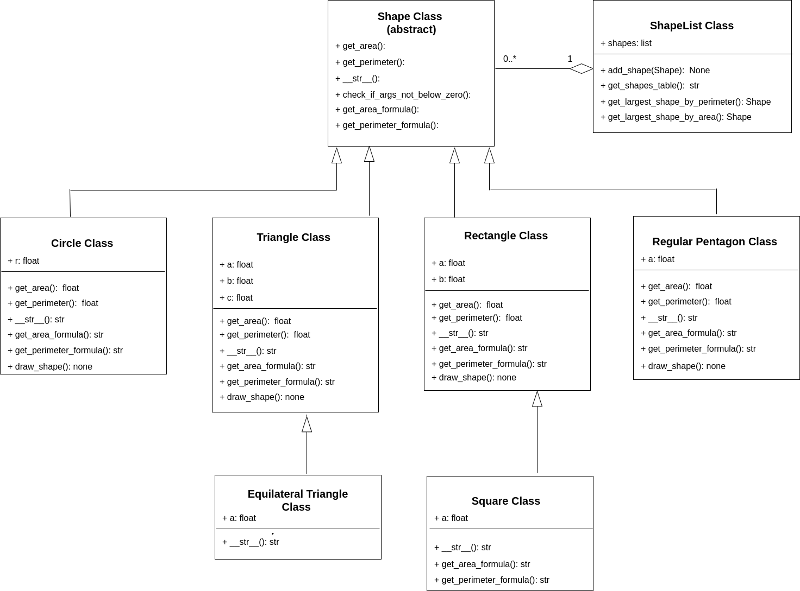

# Project 5: Geometry

In this project, you will write an object-oriented Python Application for geometry. A [Unified Modeling Language (UML) Diagram](https://www.geeksforgeeks.org/unified-modeling-language-uml-introduction/) is a general-purpose modeling language. The main aim of UML is to define a standard way to visualize the way a system has been designed. We will be building the following classes:



The triangles pointing from one class to another indicates a child-parent relationship. For example, `Circle` is a child of `Shape`.

The diamond indicates a "has-a" relationship. For example, the `ShapeList` has zero or more (`0..*`) shapes.

Instead each box, you can see the attributes in the top and the mehods in the bottom with the expected return type.

Follow the instructions below to complete the project.

## Instructions

### 1. Run `main.py`

**You do NOT need  to edited `main.py` in any way.** This is the main entrance of the program,  allows user to create and add shapes to a list and do some things with it.

Running the program will present the following menu to the user:

```text
Learn Geometry.
  What do you want to do?
  (1) Add new shape
  (2) Show all shapes
  (3) Show shape with the largest perimeter
  (4) Show shape with the largest area
  (5) Show formulas
  (0) Exit program
```

To understand the behavior of this program:

1. Run `main.py`
2. Select option `(1) Add new shape`.
3. Enter `t,3,4,5` to add a triangle with sides of length 3, 4, and 5.
4. Select option `(2) Add new shape` to see the `ShapeList` populated with the triangle you added.

The features do the following:

1. `Add new shape`: This feature allows user to add new shape to shapes list. User should be able to choose what kind of shapes he/she wants to add. Then he/she should specify attributes that a given shape requires.

2. `Show all shapes`: This feature should print table containing all shapes added to the list. Take a look at `ShapeList.get_shapes_table()`

3. `Show shape with the largest perimeter`: This feature prints shape with the largest perimeter from a list.  

4. `Show shape with the largest area`: This feature prints shape with the largest area from a list.

5. `Show formulas`: This feature should allow user to choose shape type and print it's formulas (perimeter, area).

### 2. Review the Starter Code

Experiment with the starter code to understand how it works. Pay special attention to `rectangle.py` and `equilateral_triangle.py`. These are already completed and are to serve as examples for the classes you will implement.

The `Shape` class is an abstract class. **Do NOT modify it in any way!** We won't create an instance of it. We only use it as a parent class for other concrete classes. You can think of it as a template for its children. It contains attributes and methods that should be implemented in child classes.

The `@classmethod` above a couple of the methods is a special type of *decorator*. Read this [Stack Overflow Thread](https://stackoverflow.com/questions/12179271/meaning-of-classmethod-and-staticmethod-for-beginner). Decorators in Python can be used to extend the behavior of a function. Read the [Primer on Python Decorators](https://realpython.com/primer-on-python-decorators/) for more information.

### 3. Implement the other classes

Your first coding task will be implement the remaining shape classes: `circle.py`, `pentagon.py`, `rectangle.py`, and `square.py`. You do *not* need to implement the `draw_shape()` methods indicated in the UML diagram above.

Calculations must be mathematical correct and the *string* formatted to two decimal places. Do NOT round the float.

### 4. Finish `ShapeList`

Implement `get_largest_shape_by_perimeter` and `get_largest_shape_by_area` in `shape_list.py`:

- `get_largest_shape_by_perimeter(self)`: Returns shape with largest perimeter.
- `get_largest_shape_by_area(self)`: Returns shape with largest area.

## Grading

Verify the automated tests pass by running `pytest` in the terminal. The automated tests will also be run whenever you commit your files and sync them to the repository. Commit often!

To test without committing, run `python -m pytest tests/test_shapes` and `python -m pytest tests/test_shapes`.

The following table shows the point distribution for each part.

| **Allocated Points** | **Description** |
| -------------------- | -------------------- |
| **Shape Classes**    |              |
| **15 each**          | Passes tests |
| **5 each**           | Adheres to style considerations, primarily docstrings |
|                      ||
| **`ShapeList`**      ||
| **10 each**          | Passes tests |
|                      ||
|                      | **Deductions** |
| **\-5 to -10**       | Debugging statements left in the final program, which makes it difficult to follow logic. |
| **\-0 to -20**       | Not citing code referenced online. This is apparent when the submission uses code not discussed in class. |
| **\-100**            | Plagiarism |

|**Style Considerations** |
|-------------------------|
| Code is organized into logical chunks with comments describing the behavior of the code.|
| Functions contain a docstring describing the behavior of the function.|
| Code is organized using appropriate control structures (functions, loops, etc.) to eliminate lengthy copied or nearly identical sections of code.|
| Variables names are descriptive.|
| Spacing and style are consistent throughout the entire program.|
